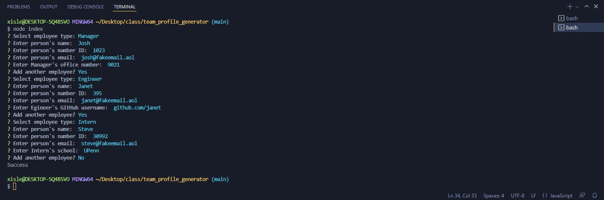
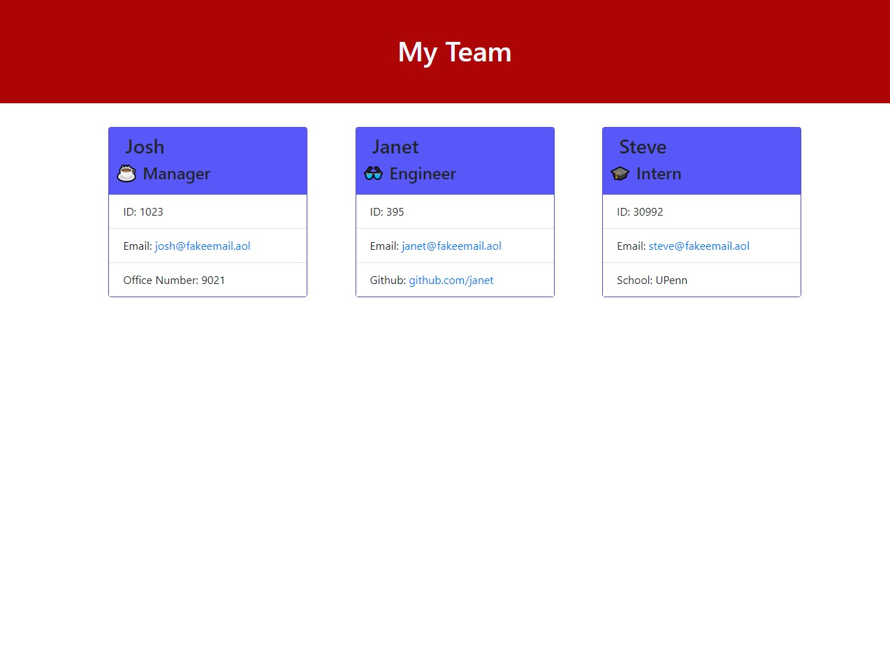

# Team Generator
## Description
A Node.js command-line application that takes in information about employees on a software engineering team, then generates an HTML webpage that displays summaries for each person. Which includes Manager, Engineer, and Intern. 

## Use
Once "node index" has been ran, prompts will be given for the user to follow the intructions on entering the required information about the selected employee. Once all information is entered and user ends prompts, an index.html page will be generated for the user to use. 

### Pictures

